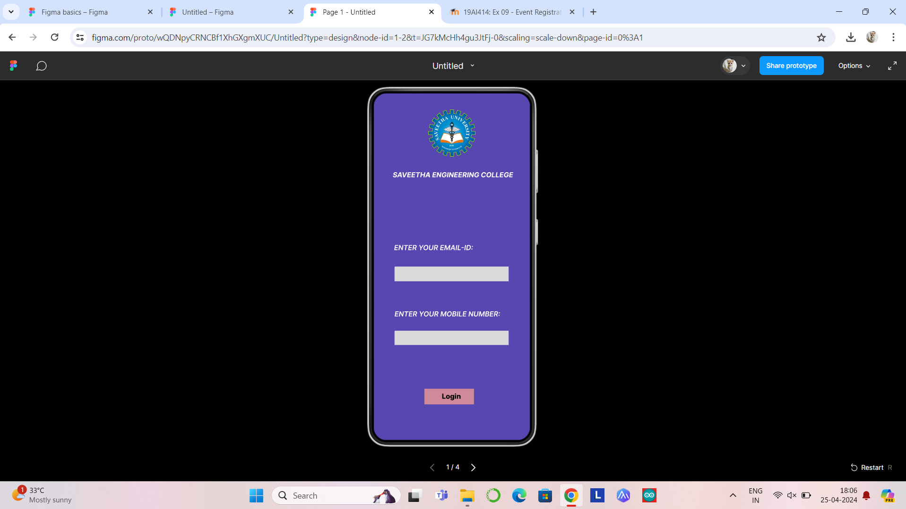
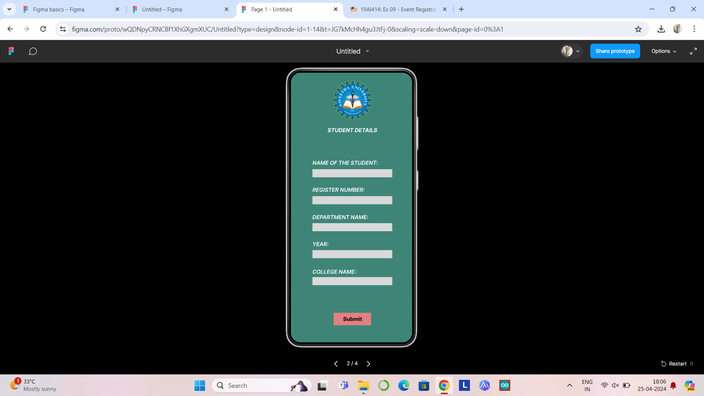
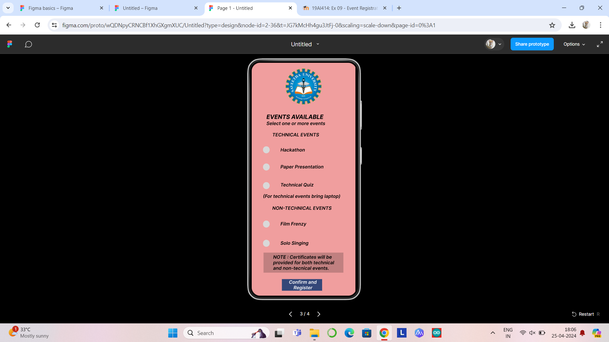
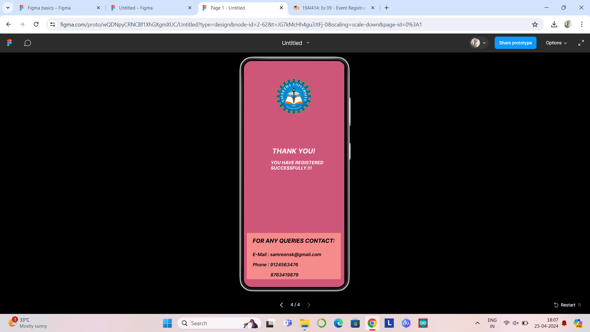

# Ex09 Event Registration Web Application
## Date : 25-04-2024

## AIM:
To design, develop and deploy a web application for event registration.

## DESIGN STEPS:

### Step 1:
Create a new frame.

### Step 2:
Select any one preset size of your choice.

### Step 3:
Select the shapes you need.

### Step 4:
Import images as needed.

### Step 5:
Create pages based on your need and link them.

### Step 6:

Validate the HTML and CSS code.

### Step 6:

Publish the website in the given URL.

## DESIGN TOOL:
Figma
## CODE:
### page-1
```
<div style="width: 360px; height: 800px; position: relative; background: #5647B1">
  <div style="width: 313px; height: 18px; left: 44px; top: 179px; position: absolute; color: white; font-size: 16px; font-family: Inter; font-style: italic; font-weight: 700; word-wrap: break-word">SAVEETHA ENGINEERING COLLEGE</div>
  
  <div style="width: 263px; height: 34px; left: 48px; top: 400px; position: absolute; background: #D9D9D9"></div>
  <div style="left: 47px; top: 347px; position: absolute; color: white; font-size: 16px; font-family: Inter; font-style: italic; font-weight: 600; word-wrap: break-word">ENTER YOUR EMAIL-ID:</div>
  <div style="width: 263px; height: 33px; left: 48px; top: 548px; position: absolute; background: #D9D9D9"></div>
  <div style="left: 48px; top: 500px; position: absolute; color: white; font-size: 16px; font-family: Inter; font-style: italic; font-weight: 600; word-wrap: break-word">ENTER YOUR MOBILE NUMBER:</div>
  <div style="width: 114px; height: 36px; left: 117px; top: 682px; position: absolute; background: #D0899A"></div>
  <div style="left: 157px; top: 690px; position: absolute; color: black; font-size: 16px; font-family: Inter; font-weight: 800; word-wrap: break-word">Login</div>
</div>
```
### page-2
```
<div style="width: 366px; height: 826px; position: relative; background: #3E8578">
  
  
  <div style="width: 237px; height: 24px; left: 64px; top: 287px; position: absolute; background: #D9D9D9"></div>
  <div style="width: 237px; height: 24px; left: 64px; top: 367px; position: absolute; background: #D9D9D9"></div>
  <div style="width: 237px; height: 24px; left: 64px; top: 447px; position: absolute; background: #D9D9D9"></div>
  <div style="width: 237px; height: 24px; left: 64px; top: 527px; position: absolute; background: #D9D9D9"></div>
  <div style="width: 237px; height: 24px; left: 64px; top: 607px; position: absolute; background: #D9D9D9"></div>
  <div style="width: 111px; height: 37px; left: 127px; top: 713px; position: absolute; background: #E38080"></div>
  <div style="left: 155px; top: 722px; position: absolute; color: #121010; font-size: 16px; font-family: Inter; font-weight: 800; word-wrap: break-word">Submit</div>
  <div style="left: 109px; top: 162px; position: absolute; color: white; font-size: 16px; font-family: Inter; font-style: italic; font-weight: 700; word-wrap: break-word">STUDENT DETAILS</div>
  <div style="left: 64px; top: 259px; position: absolute; color: white; font-size: 16px; font-family: Inter; font-style: italic; font-weight: 600; word-wrap: break-word">NAME OF THE STUDENT:</div>
  <div style="left: 64px; top: 339px; position: absolute; color: white; font-size: 16px; font-family: Inter; font-style: italic; font-weight: 600; word-wrap: break-word">REGISTER NUMBER:</div>
  <div style="left: 64px; top: 420px; position: absolute; color: white; font-size: 16px; font-family: Inter; font-style: italic; font-weight: 600; word-wrap: break-word">DEPARTMENT NAME:</div>
  <div style="left: 64px; top: 500px; position: absolute; color: white; font-size: 16px; font-family: Inter; font-style: italic; font-weight: 600; word-wrap: break-word">YEAR:</div>
  <div style="left: 64px; top: 582px; position: absolute; color: white; font-size: 16px; font-family: Inter; font-style: italic; font-weight: 600; word-wrap: break-word">COLLEGE NAME:</div>
</div>
```
### page-3
```
div style="width: 356px; height: 819px; position: relative; background: #F09E9E">
  
  <div style="width: 23px; height: 24px; left: 39px; top: 542px; position: absolute; background: #D9D9D9; border-radius: 9999px"></div>
  <div style="width: 23px; height: 24px; left: 39px; top: 287px; position: absolute; background: #D9D9D9; border-radius: 9999px"></div>
  <div style="width: 23px; height: 24px; left: 39px; top: 346px; position: absolute; background: #D9D9D9; border-radius: 9999px"></div>
  <div style="width: 23px; height: 24px; left: 39px; top: 410px; position: absolute; background: #D9D9D9; border-radius: 9999px"></div>
  <div style="width: 23px; height: 24px; left: 39px; top: 608px; position: absolute; background: #D9D9D9; border-radius: 9999px"></div>
  <div style="left: 51px; top: 174px; position: absolute; color: black; font-size: 20px; font-family: Inter; font-style: italic; font-weight: 700; word-wrap: break-word">EVENTS AVAILABLE</div>
  <div style="left: 51px; top: 199px; position: absolute; color: black; font-size: 16px; font-family: Inter; font-style: italic; font-weight: 600; word-wrap: break-word">Select one or more events</div>
  <div style="left: 71px; top: 238px; position: absolute; color: black; font-size: 16px; font-family: Inter; font-style: italic; font-weight: 600; word-wrap: break-word">TECHNICAL EVENTS</div>
  <div style="left: 71px; top: 490px; position: absolute; color: black; font-size: 16px; font-family: Inter; font-style: italic; font-weight: 600; word-wrap: break-word">NON-TECHNICAL EVENTS</div>
  <div style="width: 324px; left: 39px; top: 449px; position: absolute; color: black; font-size: 16px; font-family: Inter; font-style: italic; font-weight: 600; word-wrap: break-word">(For technical events bring laptop)</div>
  <div style="width: 138px; height: 40px; left: 104px; top: 743px; position: absolute; background: #344778"></div>
  <div style="width: 136px; left: 128px; top: 744px; position: absolute; color: white; font-size: 16px; font-family: Inter; font-style: italic; font-weight: 600; word-wrap: break-word">Confirm and <br/>    Register</div>
  <div style="width: 85px; height: 18px; left: 99px; top: 290px; position: absolute; color: black; font-size: 16px; font-family: Inter; font-style: italic; font-weight: 600; word-wrap: break-word">Hackathon</div>
  <div style="left: 99px; top: 348px; position: absolute; color: black; font-size: 16px; font-family: Inter; font-style: italic; font-weight: 600; word-wrap: break-word">Paper Presentation</div>
  <div style="left: 99px; top: 410px; position: absolute; color: black; font-size: 16px; font-family: Inter; font-style: italic; font-weight: 600; word-wrap: break-word">Technical Quiz</div>
  <div style="left: 99px; top: 544px; position: absolute; color: black; font-size: 16px; font-family: Inter; font-style: italic; font-weight: 600; word-wrap: break-word">Film Frenzy</div>
  <div style="left: 99px; top: 610px; position: absolute; color: black; font-size: 16px; font-family: Inter; font-style: italic; font-weight: 600; word-wrap: break-word">Solo Singing</div>
  <div style="width: 274px; height: 69px; left: 41px; top: 652px; position: absolute; background: #C08080"></div>
  <div style="width: 219px; left: 74px; top: 658px; position: absolute; color: black; font-size: 16px; font-family: Inter; font-style: italic; font-weight: 600; word-wrap: break-word">NOTE : Certificates will be provided for both technical and non-tecnical events.</div>
</div>
```
### page-4
```
<div style="width: 356px; height: 826px; position: relative; background: #CD5679">
  
  <div style="left: 101px; top: 305px; position: absolute; color: white; font-size: 24px; font-family: Inter; font-style: italic; font-weight: 700; word-wrap: break-word">THANK YOU!</div>
  <div style="width: 253px; left: 96px; top: 351px; position: absolute; color: white; font-size: 16px; font-family: Inter; font-style: italic; font-weight: 700; word-wrap: break-word">YOU HAVE REGISTERED SUCCESSFULLY.!!!</div>
  <div style="width: 333px; height: 164px; left: 11px; top: 609px; position: absolute; background: #F58B8B"></div>
  <div style="left: 95px; top: 748px; position: absolute; color: black; font-size: 16px; font-family: Inter; font-style: italic; font-weight: 600; word-wrap: break-word">8763419879</div>
  <div style="left: 32px; top: 712px; position: absolute; color: black; font-size: 16px; font-family: Inter; font-style: italic; font-weight: 600; word-wrap: break-word">Phone : 9124563476</div>
  <div style="left: 32px; top: 625px; position: absolute; color: black; font-size: 20px; font-family: Inter; font-style: italic; font-weight: 700; word-wrap: break-word">FOR ANY QUERIES CONTACT:</div>
  <div style="left: 32px; top: 676px; position: absolute; color: black; font-size: 16px; font-family: Inter; font-style: italic; font-weight: 600; word-wrap: break-word">E-Mail : samreensk@gmail.com   </div>
</div>
```
## OUTPUT:





## RESULT:
The program to design, develop and deploy a web application for event registration is completed successfully.
